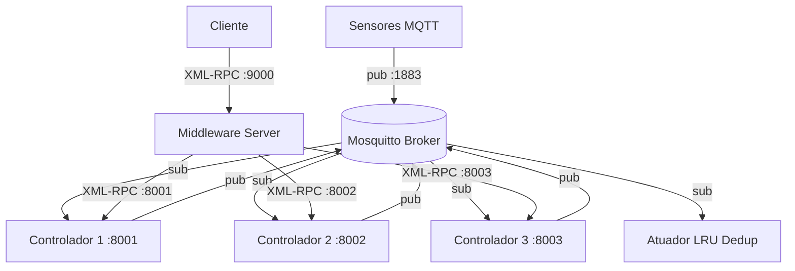

# Trabalho Prático 1 - Sistemas Distribuídos
## Estufa Agrícola Automatizada — Sistema Distribuído com MQTT e XML-RPC

> **Relatório Técnico Completo:** [`relatorio/relatorio.md`](relatorio/relatorio.md)

Este projeto implementa um sistema distribuído para controle automatizado de uma estufa agrícola, combinando mensageria assíncrona pub/sub (MQTT) com invocação remota síncrona (XML-RPC), replicação ativa com tolerância a falhas Byzantinas e deduplicação de comandos via cache LRU.

---

## Arquitetura do Sistema



### Componentes

| Componente | Arquivo | Descrição |
|---|---|---|
| **Broker MQTT** | Docker (Mosquitto) | Central de mensagens assíncronas (pub/sub) |
| **Sensor** | `estufa/sensor.py` | Publica temperatura e umidade simuladas |
| **Controlador (×3)** | `estufa/controlador.py` | Lógica de decisão + Servidor XML-RPC (:8001–:8003) |
| **Middleware Engine** | `estufa/middleware.py` | Algoritmo de votação BFT (interno) |
| **Middleware Server** | `estufa/middleware_server.py` | Servidor standalone :9000 — ponto de entrada único |
| **Cliente** | `estufa/cliente.py` | Interface CLI; conecta exclusivamente ao Middleware |
| **Atuador** | `estufa/atuador.py` | Executa comandos; cache LRU anti-duplicatas |

---

## Estrutura do Projeto

```
trabalho_pratico1/
│
├── .gitignore
├── docker-compose.yml              # Broker Mosquitto
├── mosquitto/
│   └── mosquitto.conf
│
├── requirements.txt                # paho-mqtt, pytest
├── README.md                       # Este arquivo
│
├── estufa/                         # Pacote principal
│   ├── __init__.py
│   ├── config.py                   # Constantes globais (portas, tópicos, limiares)
│   ├── sensor.py                   # Publicador MQTT
│   ├── atuador.py                  # Assinante MQTT + cache LRU
│   ├── controlador.py              # Decisão + XML-RPC Server + boot-sync
│   ├── middleware.py               # Motor de votação BFT (uso interno)
│   ├── middleware_server.py        # Servidor XML-RPC standalone (:9000)
│   └── cliente.py                  # Cliente CLI
│
├── tests/
│   ├── __init__.py
│   ├── test_atuador.py             # Testes LRU deduplication
│   ├── test_controlador.py         # Testes lógica de decisão + IDs
│   └── test_middleware.py          # Testes votação BFT (com mocks)
│
├── scripts/
│   ├── start_all.sh                # Script de inicialização Unix
│   └── start_all.ps1               # Script de inicialização Windows
│
└── relatorio/
    └── relatorio.md                # Relatório técnico acadêmico
```

---

## Correções Arquiteturais (V2)

1. **Middleware Standalone:** O middleware opera como um processo servidor independente (`middleware_server.py`, porta 9000). Clientes nunca se conectam diretamente aos controladores.

2. **Transferência de Estado no Boot:** Controladores sincronizam seu estado local via Middleware antes de iniciar o consumo MQTT, garantindo convergência imediata após crash recovery.

3. **Deduplicação Determinística:** Controladores geram `comando_id` como `MD5(acao + sensor_timestamp)`. Como todos recebem o mesmo payload MQTT (mesmo timestamp), produzem o mesmo hash. O Atuador usa cache LRU para descartar as 2 publicações redundantes.

---

## Pré-requisitos

- Python 3.10+
- Docker Desktop (para o broker Mosquitto)

```bash
pip install -r requirements.txt
```

---

## Como Executar

> ⚠️ **A ordem de inicialização é obrigatória.** Os controladores tentam sincronizar estado com o Middleware durante o boot.

### Opção 1 — Scripts automatizados

**Unix/macOS:**
```bash
bash scripts/start_all.sh
```

**Windows (PowerShell):**
```powershell
.\scripts\start_all.ps1
```

### Opção 2 — Manual (terminal separado para cada processo)

**Terminal 1 — Broker MQTT:**
```bash
docker compose up -d
```

**Terminal 2 — Middleware Server (INICIAR ANTES DOS CONTROLADORES):**
```bash
cd trabalho_pratico1
python -m estufa.middleware_server
```

**Terminais 3, 4, 5 — Controladores:**
```bash
python -m estufa.controlador --id ctrl_1 --port 8001 --data data_ctrl_1.json
python -m estufa.controlador --id ctrl_2 --port 8002 --data data_ctrl_2.json
python -m estufa.controlador --id ctrl_3 --port 8003 --data data_ctrl_3.json
```

**Terminal 6 — Atuador:**
```bash
python -m estufa.atuador
```

**Terminal 7 — Sensor:**
```bash
python -m estufa.sensor --modo normal   # Operação normal
python -m estufa.sensor --modo seco     # Força acionamento da bomba
python -m estufa.sensor --modo quente   # Força acionamento do exaustor
```

**Terminal 8 — Cliente:**
```bash
python -m estufa.cliente
```

### Demo Byzantina

```bash
# Substitua ctrl_2 por uma réplica Byzantina
python -m estufa.controlador --id ctrl_2 --port 8002 --data data_ctrl_2.json --byzantino
```

---

## Testes Automatizados

Os testes unitários **não requerem** broker MQTT ou processos em execução:

```bash
# Da raiz do projeto (trabalho_pratico1/)
pytest tests/ -v

# Arquivo específico
pytest tests/test_controlador.py -v
pytest tests/test_middleware.py -v
pytest tests/test_atuador.py -v
```

---

## Limiares de Controle

| Sensor | Condição | Atuador | Ação |
|---|---|---|---|
| Temperatura | > 35°C | Exaustor | LIGAR |
| Temperatura | < 15°C | Exaustor | DESLIGAR |
| Umidade do Solo | < 30% | Bomba de Irrigação | LIGAR |
| Umidade do Solo | > 70% | Bomba de Irrigação | DESLIGAR |

---

## Tolerância a Falhas

| Cenário | Comportamento |
|---|---|
| 1 controlador crashado | Quórum 2/3 mantido; sistema opera normalmente |
| 1 controlador Byzantino | Votação neutraliza resposta divergente; resultado honesto retornado |
| 2 controladores crashados | ErroQuorum levantado; cliente recebe erro claro |
| Controlador reinicia | Sincroniza estado via Middleware antes de retomar operação |
